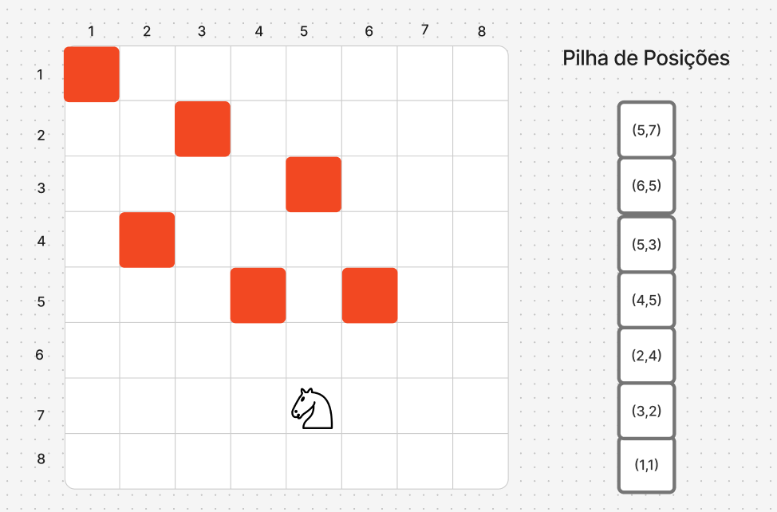
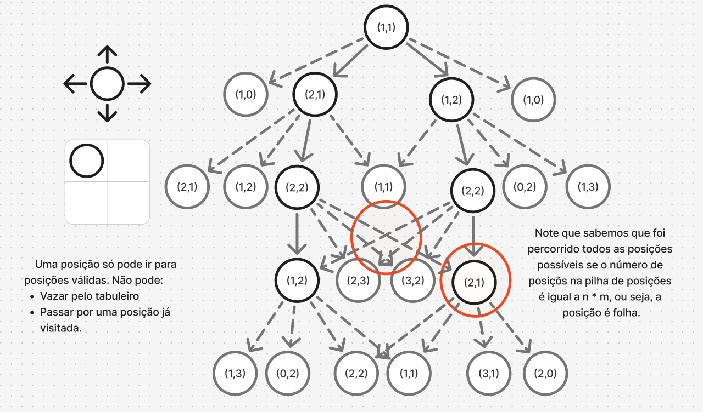

# Integrantes

Guilherme Oliveira Pimentel
Juliana Alves Poustka
Mateus Regasi Gomes Martins

# Breve resumo

Primeiramente, foram elaboradas pelos integrantes Guilherme e Juliana a função “main” e as funções “parseLine” e “iteração”, a fim de ler os dados de entrada do usuário. posteriormente, a função “parseLine” foi descartada e a main foi adaptada para ler um arquivo .txt (linhas de texto) e aplicar no algoritmo.

Posteriormente,em dupla, Mateus e Guilherme definiram o “Posicao” e “Dimensao”, seus construtores e getters. 
Fizeram, também, a função “posEq” que checa se duas coordenadas são equivalentes. Função essa usada mais tarde na função InList, que por sua vez checa se uma posição já está dentro da lista de caminhos percorridos. 

A partir daqui, o trabalho foi feito em trio por ligação. Foram feitas as funções “movimentos”, que definia os movimentos “brutos” do cavalo. Após ela, a função “movimentosVálidos”, cuja principal responsabilidade é, a partir da posição atual do cavalo, determinar para quais casas futuras ele pode pular.
Dentro da cláusula “where” desta função, existem as funções auxiliares locais filtro e “aplicaFiltro”. A função filtro checa se um movimento é válido de acordo com as condições estabelecidas. Já a função “aplicaFiltro” é uma função recursiva que percorre a lista de movimentos aplicando o “filtro” a cada um deles e mantendo apenas os que passam no teste.

A função “passeio” é o ponto de entrada que inicia o algoritmo de busca. Ela utiliza duas funções auxiliares recursivas, definidas na cláusula “where”, para realizar o backtracking. 
A função auxiliar inspeciona o estado atual do caminho (lista) e determina se é um estado folha ou se a busca deve prosseguir. Já a função “testarMovimentos” itera sobre um conjunto de movimentos e explora cada um deles sequencialmente.

# Rascunhos

